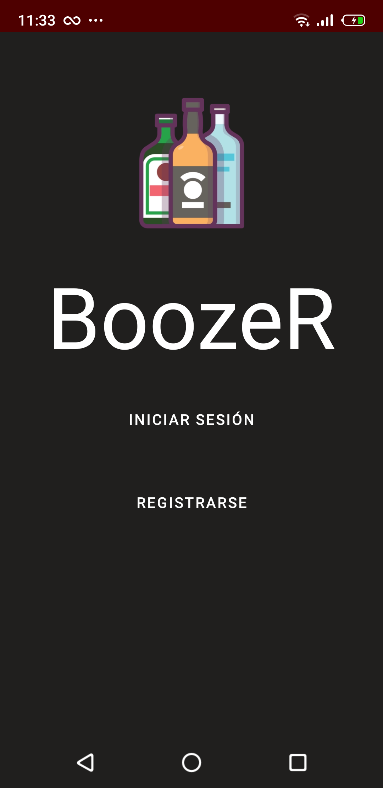
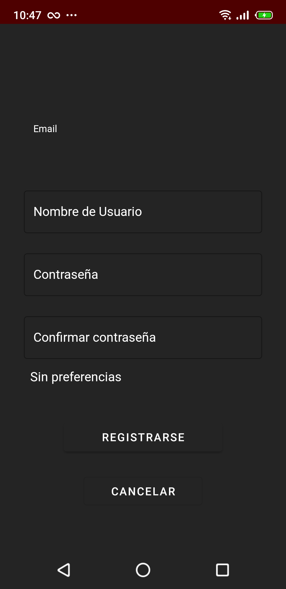
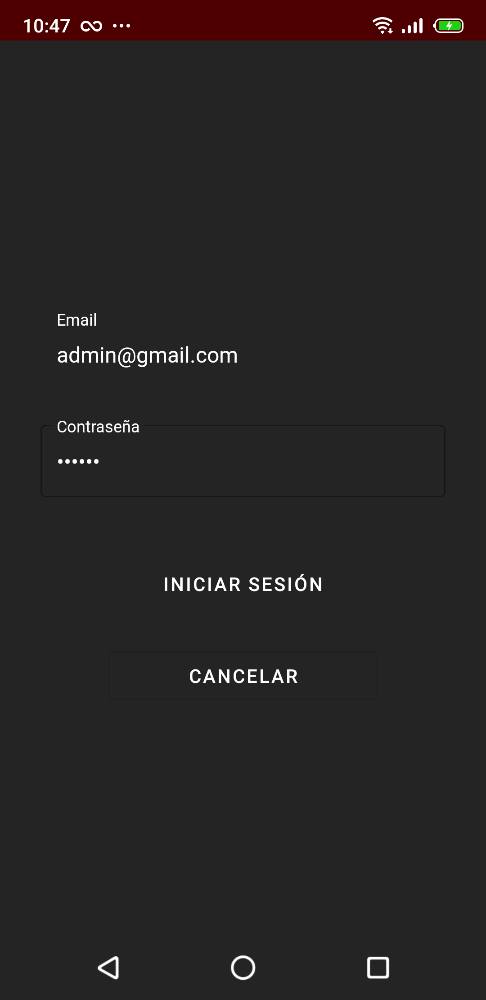
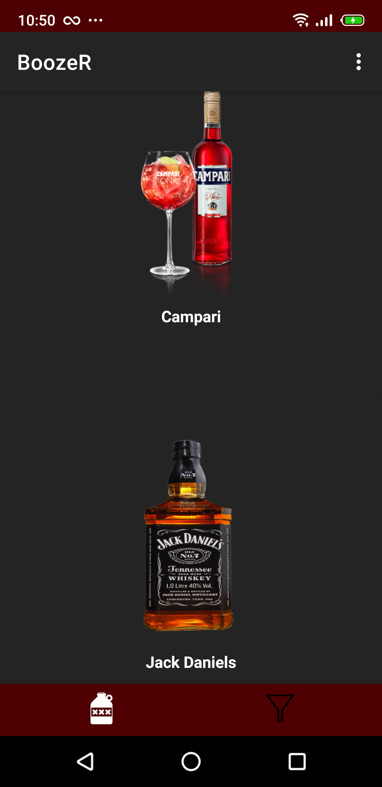
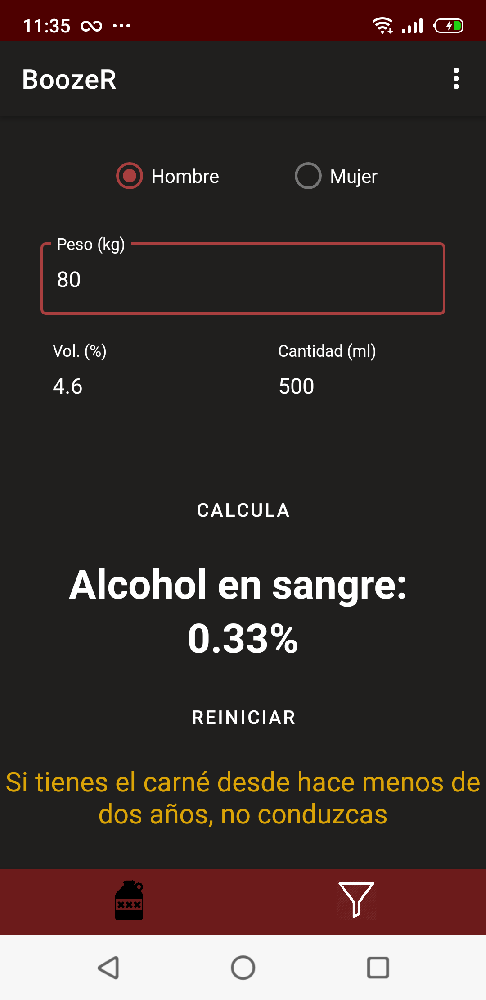
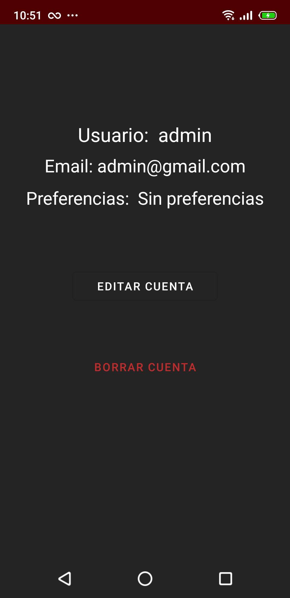
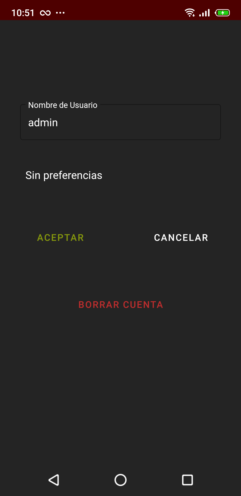
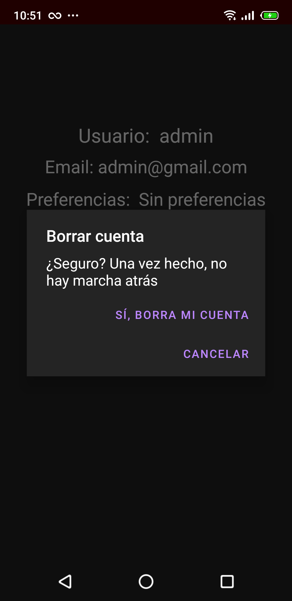

# _BoozeR (app móvil)_

## _Secciones de BoozeR_
- Índice  

 

- Registro  

 

- Inicio de Sesión  

 

- Vista Principal, que a su vez contendrá varios fragmentos: 
  - Catálogo de Bebidas  
  
    
  
  - Calculador de Alcohol en Sangre  
  
   
  
- Perfil  

  

  - Editar Cuenta

  

  - Borrar Cuenta

 
