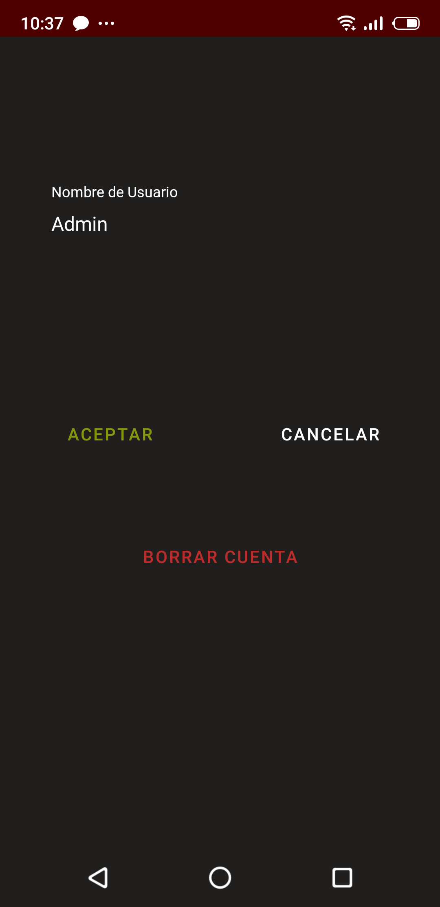
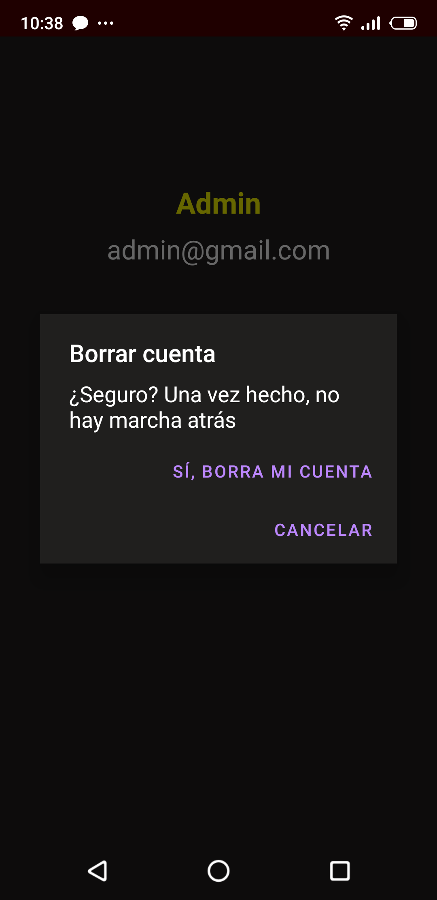

# _BoozeR (app móvil)_
BoozeR es una aplicación móvil desarrollada en Android Studio que busca facilitar la vida a los usuarios que quieran descubrir bebidas nuevas.
Principalmente, la aplicación está destinada a gestionar bebidas alcohólicas. No obstante, también será posible gestionar bebidas sin alcohol, así como complementos para las mismas.

## Instalación
Simplemente hay que descargarse la [apk](https://github.com/rafaelaragon/boozeR/blob/master/BoozeR_08-05-2020.apk) e instalarla en el dispositivo. (Se requiere nivel de API 21 o superior).
# _Secciones de BoozeR_
## 1. Índice 

## 2. Registro 

## 3. Inicio de Sesión 

## 4. Vista Principal, que a su vez contiene varios fragmentos:
   - ### Catálogo de Bebidas  
     * #### Catálogo     
     * #### Filtro     
     * #### Barra de Búsqueda     
   - ### Bebidas Favoritas   
     
       
   - ### Calculador de Alcohol en Sangre   
         
## 5. Perfil 
   
     
   Aquí se muestran los datos del usuario. El usuario puede:  
   - Editar Perfil  
     
   - Borrar Usuario  
   
