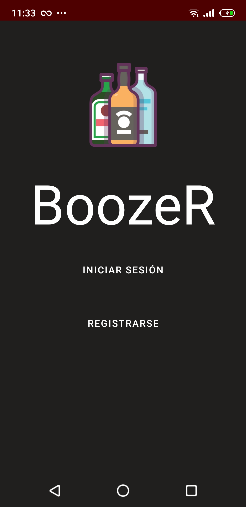
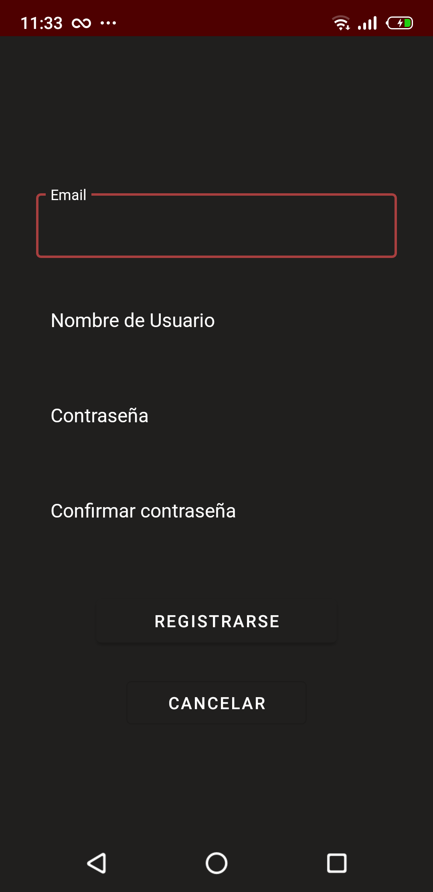
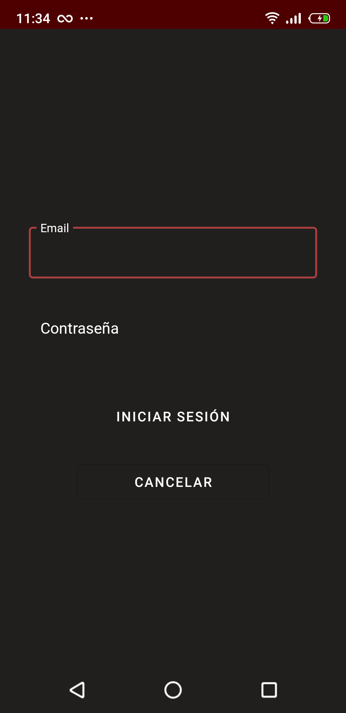
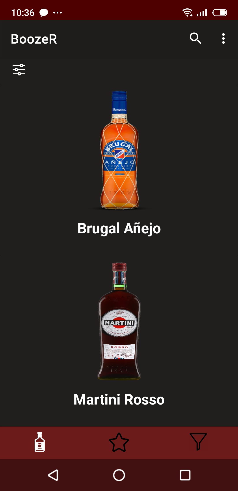
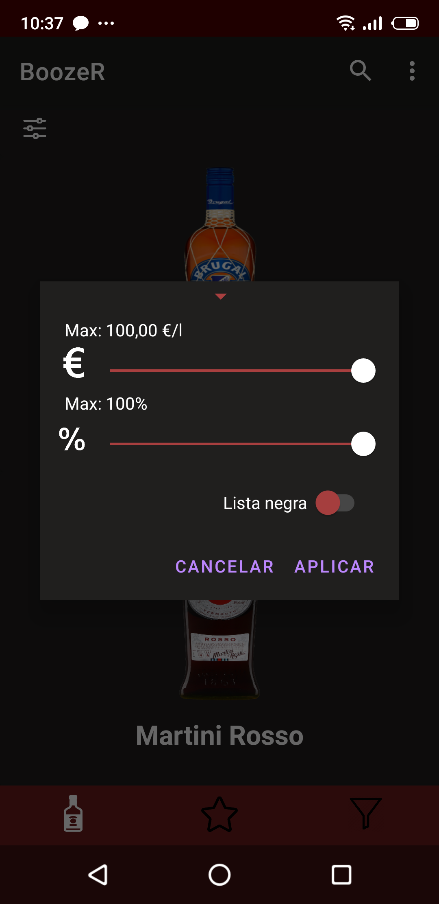
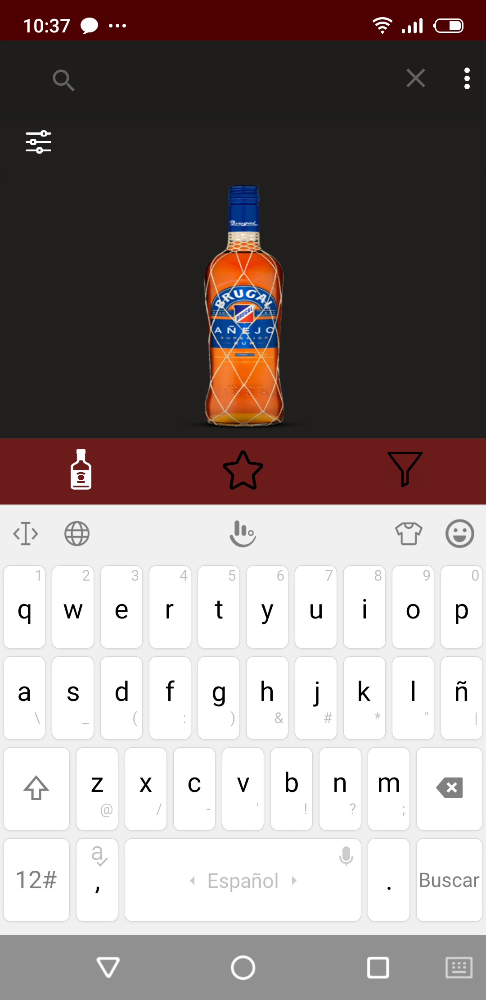
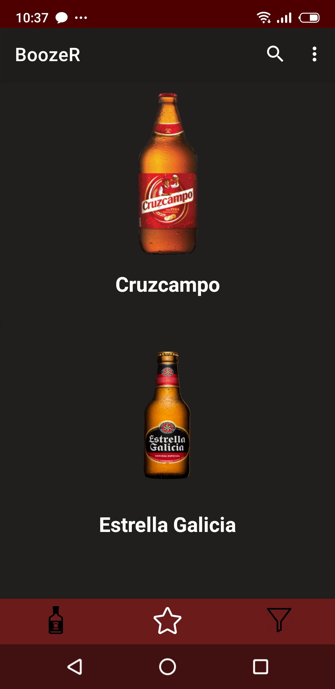
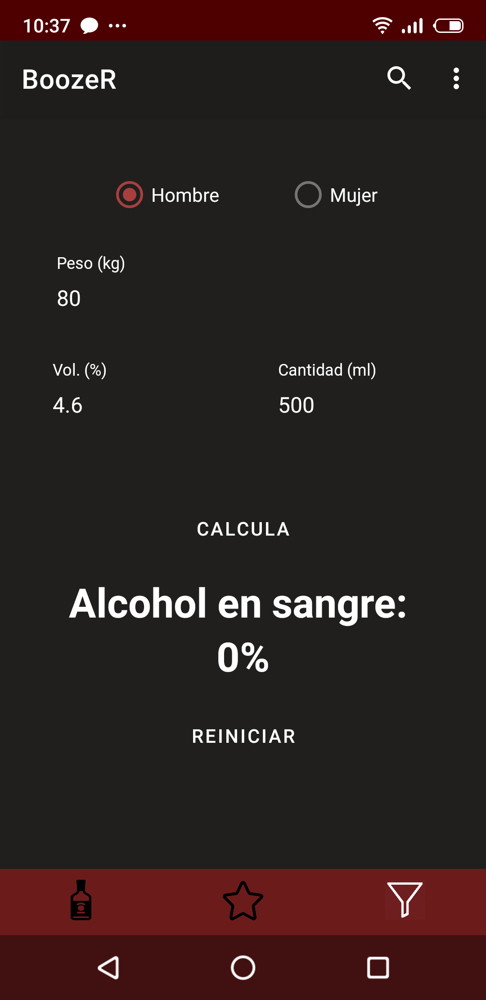
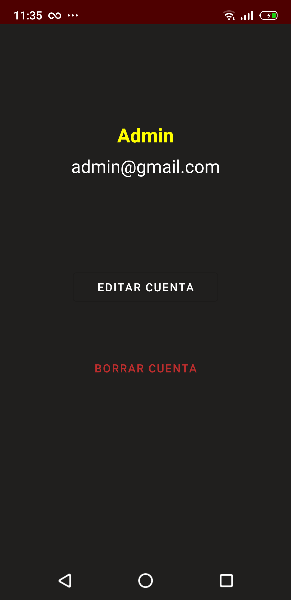

# _BoozeR (app móvil)_
BoozeR es una aplicación móvil desarrollada en Android Studio que busca facilitar la vida a los usuarios que quieran descubrir bebidas nuevas.
Principalmente, la aplicación está destinada a gestionar bebidas alcohólicas. No obstante, también será posible gestionar bebidas sin alcohol, así como complementos para las mismas.

## Instalación
Simplemente hay que descargarse la [apk](https://github.com/rafaelaragon/boozeR/blob/master/BoozeR_08-05-2020.apk) e instalarla en el dispositivo. (Se requiere nivel de API 21 o superior).
## _Secciones de BoozeR_
### Índice  

 

### Registro  

 

### Inicio de Sesión  

 

### Vista Principal, que a su vez contiene varios fragmentos: 
  ### - Catálogo de Bebidas  
  - Catálogo
  
    
  - Filtro
  
    
  - Barrade Búsqueda
  
    
  ### - Bebidas Favoritas  
  
   
  ### - Calculador de Alcohol en Sangre  
  
   
  
### Perfil  

 
