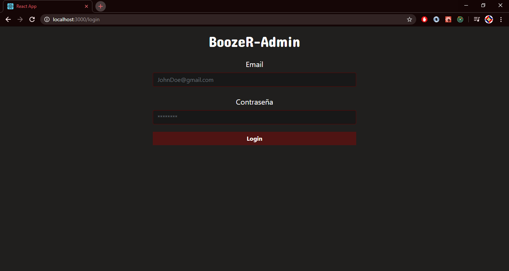
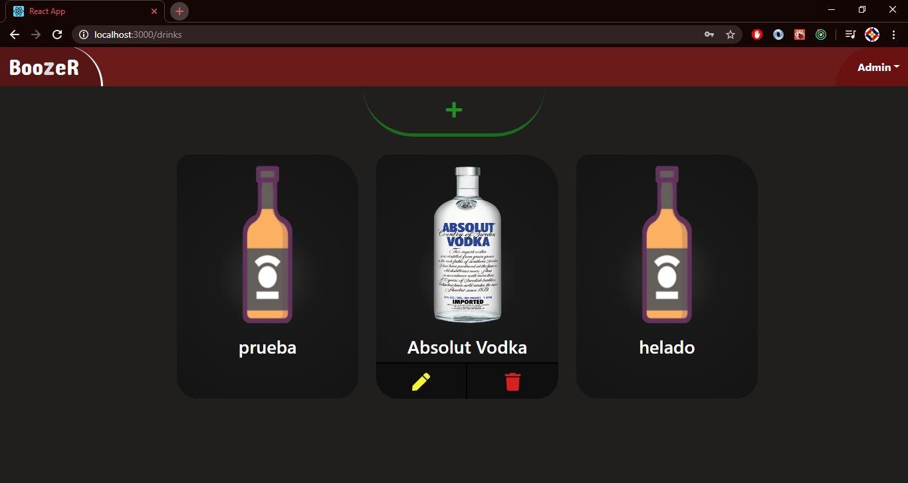
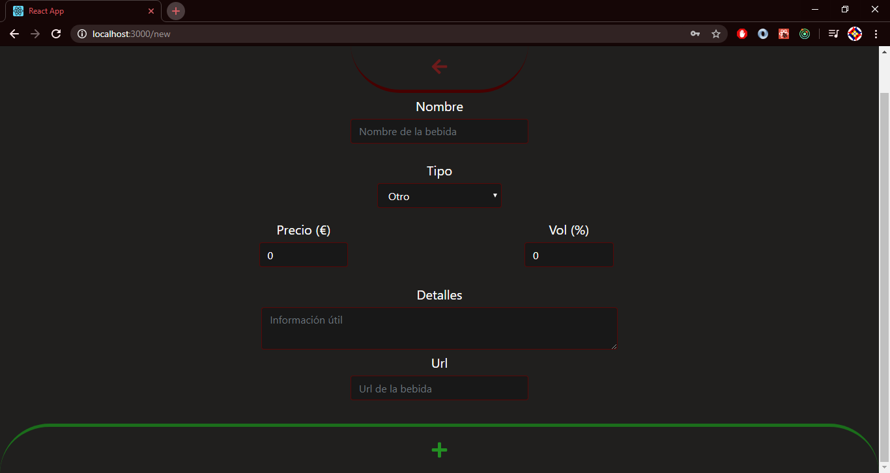
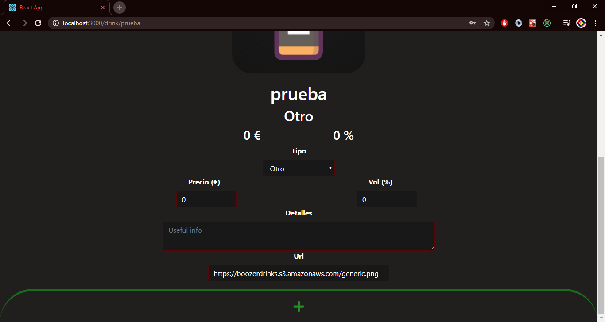

# Boozer-Admin
Boozer-Admin es la aplicación web de Boozer creada usando React. Ha sido creada para que los administradores puedan gestionar las bebidas de la aplicación móvil. Pudiendo así crear, editar y borrar bebidas.

## Instalación
Para la versión final, intentaré hostear la página web en Github Pages. Por ahora, para poder usarla en local, debéis de tener una versión estable de NodeJS y de npm.

Teniendo el proyecto descargado, para poder iniciar la aplicación hay que escribir en un terminal (en la raíz del proyecto):
1. `npm install` para instalar todas las dependencias del proyecto.
2. `npm start` para que la aplicación se abra.

Si se han seguido los pasos, la aplicación debería abrirse en una pestaña nueva en vuestro navegador predeterminado. 

Finalmente, para acceder a las páginas que requieren autenticación, podéis iniciar sesión con el correo *admin@gmail.com* y la contraseña *123456*. Podéis probar la aplicación cuanto queráis (crear, editar y borrar bebidas), pero porfavor, dejad la base de datos tal como os la encontréis.

## Dependencias utilizadas:
- `axios` para las peticiones a la API.
- `bootstrap` y `react-bootstrap` principalmente para los formularios y los botones.
- `firebase` y `react-with-firebase-auth` para la autenticación.
- `node-sass` para trabajar los estilos cómodamente.
- `react-animated-dots` para añadir una animación mientras se revisa la autenticación.
- `react-dom` y `react-router-dom` para el routing.
- `react-toastify` para las notificaciones de error.
- `redux` y `redux-thunk` para aplicar redux a la aplicación.
- `simple-crypto-js` para encriptar la contraseña antes de añadirla al estado.

## Páginas de la aplicación:

### Login

   
Creada para restringir la entrada a la aplicación web. Sólo pueden iniciar sesión los usuarios que, además de estar registrados en firebase, tengan permisos de administración.

Al intentar iniciar sesión se revisa, por orden, que se cumpla lo siguiente:
- Los campos no estén vacíos.
- El usuario exista, es decir, se haya registrado en Firebase.
- El usuario tenga permisos de administración (esto se revisa en la tabla de usuarios de DynamoDB)

Finalmente, si se intenta acceder a una página de la aplicación sin tener permisos de administración, el usuario será redirigido automáticamente a  esta página, evitando así accesos no deseados.

### Drinks

   
Aquí se puede ver una lista de todas las bebidas guardadas en la base de datos. El administrador tiene la opción de:  
- Crear una nueva bebida pulsando el botón con el símbolo "➕".  
- Editar una bebida en particular, pulsando el lápiz (✏️) que aparece bajo la misma. 
- Borrar una bebida, pulsando la papelera (🗑️) que aparece bajo la misma.

### New

   
Esta página permite al administrador crear una nueva bebida.En caso de que la url de la imagen no exista, se usa una imagen por defecto.

### Drink

   
Por último, la página de edición permite al administrador editar una bebida existente. Se pueden todos los campos menos el nombre de la bebida, yaque lo utilizo como clave primaria en la base de datos.
