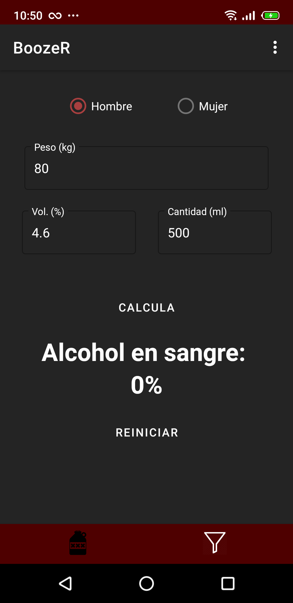

# _BoozeR_
## (Presentación) [https://docs.google.com/presentation/d/1V-Md0SyKP87gJIY4NDrheRQVYlVeGGNqkmiQywAaGYU/edit?usp=sharing]
## ¿Alguna vez has tenido problemas a la hora de elegir qué beber?
### Quizás no quieras gastarte mucho dinero. A lo mejor quieres probar un ron nuevo. O quizás simplemente no quieras algo muy cargado.
Para esos casos, y para muchos más, nació ***BoozeR***.

## _¿Qué es BoozeR?_
BoozeR es una aplicación móvil desarrollada en Android Studio que busca facilitar la vida a los usuarios que quieran descubrir bebidas nuevas.

Principalmente, la aplicación está destinada a gestionar bebidas alcohólicas. No obstante, también será posible gestionar bebidas sin alcohol, así como complementos para las mismas.  

## _Secciones de BoozeR_
- Índice  

 

- Registro  

 

- Inicio de Sesión  

 

- Vista Principal, que a su vez contendrá varios fragmentos: 
  - Catálogo de Bebidas  
  
    
  
  - Calculador de Alcohol en Sangre  
  
   
  
- Perfil  

  

  - Editar Cuenta

  

  - Borrar Cuenta

 

## _TODO_
En próximas actualizaciones, se añadira un nuevo fragmento llamado _coctelería_, en el que podrás crear tus propios cócteles a partir de bebidas ya existentes.

## _Contacto_
En caso de no entender algo, o si sencillamente quieres dar ideas para mejorar la aplicación, no dudes en contactarme a través de mi correo, rafa.ar2000@gmail.com.

